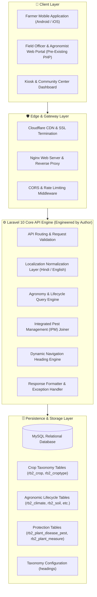
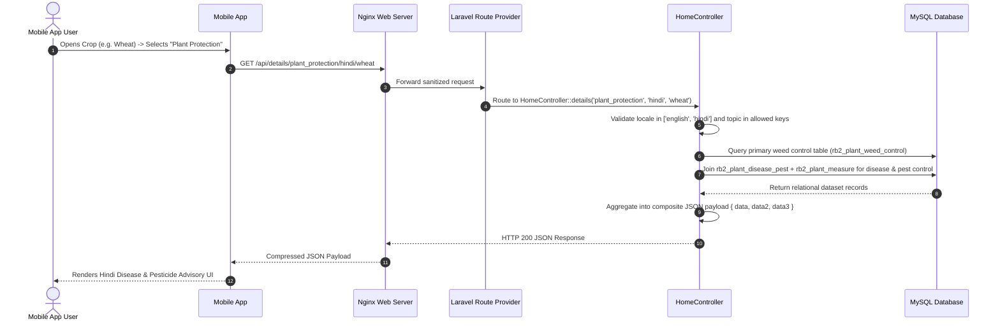

# 🏛️ Pragya Crop Advisory — System Architecture

This document details the architectural blueprint, component interactions, data boundaries, and execution flows powering the **Pragya Crop Advisory REST API (`pragya-api`)**.

> **Scope & Attribution Note:** This architecture document specifically details the **Laravel REST API Service** engineered by the author. The underlying agronomy database schema (`rb2_*`) and legacy PHP web portal pre-existed within Pragya NGO; this API architecture was engineered to modernize, wrap, and expose that legacy data to new mobile clients.

---

## 1. Architectural Philosophy

The Pragya Crop Advisory Platform is engineered with a **Decoupled API-First Architecture**. It transforms pre-existing legacy relational agricultural datasets into high-throughput, localized RESTful JSON services consumed by mobile applications and field web consoles.

---

## 2. Layered Component Architecture

### 2.1 Edge & Ingress Tier
- **Nginx Reverse Proxy:** Terminates SSL/TLS connections, manages HTTP request buffering, compresses JSON payloads via Gzip/Brotli, and proxies requests to PHP-FPM workers.
- **Security & CORS Middleware:** Regulates origin access for mobile clients and prevents unauthorized cross-origin requests.

### 2.2 Application Services Tier (Laravel 10 Engine)
The API service is built on Laravel 10, utilizing modern PHP 8.1+ capabilities:

- **Localization Normalization Layer:** Validates incoming locale parameters (`en`/`hi` or `english`/`hindi`), mapping queries to proper language partitions in the relational database.
- **Agronomy Query Engine:** Dispatches requests to 12+ specialized agronomy data tables based on topic keys (`climate`, `soil`, `variety`, `land`, `treatment`, `sowing`, `nutrient`, `irrigation`, `interculture`, `harvesting`, `weather`).
- **Composite IPM Service:** Joins pest and disease symptoms with multi-step corrective chemical/biological measures across composite count keys.
- **Dynamic Heading Taxonomy:** Serves dynamic category metadata through Eloquent ORM models (`Heading`), decoupling client navigation layouts from app binary releases.

### 2.3 Persistence & Storage Tier
- **MySQL Database:** Relational engine storing indexed agronomic datasets across 15+ normalized tables prefixed with `rb2_*`.
- **Character Encoding:** Fully configured with `utf8mb4` to support Devanagari Hindi text (`हिंदी`) without corruption or encoding loss.

---

## 3. End-to-End Request Lifecycle Flow

---

## 4. Key Architectural Decisions (ADRs)

| Area | Decision | Rationale |
|---|---|---|
| **Architecture** | API-First REST Service | Decouples mobile client release cycles from server-side database schema changes. |
| **Localization** | Multi-table Language Partitioning | Ensures complete separation of vernacular Hindi and English text records with fast indexed lookups. |
| **Data Aggregation** | Composite Response Payloads | Bundles related measures and symptoms into single JSON responses, eliminating multiple mobile network roundtrips in low-bandwidth rural areas. |
| **Taxonomy Engine** | Dynamic Headings in Database | Enables agronomists to introduce new crop advisory sections or reorder tabs without pushing mobile app updates to app stores. |
| **Fallback Handling** | Global Catch-All 404 Handler | Guarantees structured JSON error envelopes for all unmatched routes, preventing HTML stack leakages on mobile clients. |

---

## 5. Resilience & Offline-First Strategy

- **Low-Bandwidth Optimization:** Payloads are designed with minimal overhead and clean JSON keys to facilitate fast downloads over 2G/3G rural cellular networks.
- **Deterministic Topic Keys:** Fixed topic identifiers allow mobile applications to easily implement client-side SQLite/Room/AsyncStorage caching for offline farm advisory access.
- **Fail-Safe Response Envelopes:** All responses return HTTP status codes with structured error messages to prevent mobile client crashes during transient network failures.
