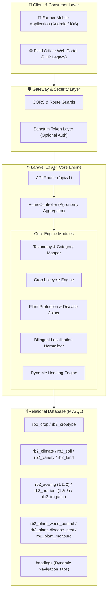
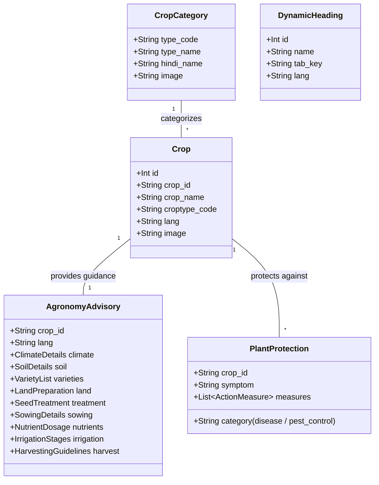

# 🌾 Pragya Crop Advisory — Bilingual AgriTech Intelligence & Operating Platform

> **A high-performance, bilingual (Hindi & English) agricultural advisory operating system and REST API engineered for Pragya NGO to empower rural smallholder farmers.**

[](https://www.php.net/)
[](https://laravel.com/)
[](https://www.mysql.com/)
[](https://restfulapi.net/)
[](https://pragya.org/about-us)
[](https://pragya.org/)
[](#-notice)

---

## 📌 Notice
*This is a public technical showcase repository documenting the architecture, domain design, and technical decisions of the **Pragya Crop Advisory Platform**. The production deployment and core client assets remain proprietary.*

---

## 💡 The Problem

Smallholder farmers in rural India face critical challenges in accessing timely, scientific, and actionable agronomy guidance:

- **Regional & Language Barrier:** Most modern agricultural research is documented in technical English, leaving vernacular Hindi-speaking rural farmers disconnected from vital agronomic practices.
- **Fragmented Advisory Datasets:** Information regarding soil preparation, optimal fertilizer dosage (NPK ratios), seed treatment, and climate requirements is scattered across disconnected government portals and physical pamphlets.
- **Crop Disease & Pest Outbreaks:** Pests and fungal infections cause devastating crop yield losses when farmers lack immediate, step-by-step biological and chemical treatment guidance.
- **Unscientific Stage-Wise Practices:** Sub-optimal irrigation timing, incorrect sowing methods, and erratic weather patterns severely reduce harvest productivity and soil health.

---

## 🚀 The Solution: Pragya Crop Advisory

Developed for **[Pragya NGO](https://pragya.org/about-us)** (an international non-governmental organization working on sustainable development and grassroots empowerment), the **Pragya Crop Advisory Platform** bridges this gap by delivering scientific, stage-by-stage agronomic intelligence to farmers via a mobile-first digital ecosystem.

1. **Native Bilingual Agronomy Engine:** Complete crop lifecycle recommendations translated and structured seamlessly in both **Hindi (हिंदी)** and **English**.
2. **End-to-End Crop Lifecycle Modeling:** 12+ dedicated agronomy modules covering climate prerequisites, soil analysis, seed selection, land preparation, fertilizer schedules, irrigation milestones, and post-harvest preservation.
3. **Integrated Pest Management (IPM) & Disease Diagnostic Engine:** Direct linkage between plant disease identification and multi-stage corrective chemical/organic measures.
4. **Mobile-First REST API Layer:** High-speed Laravel 10 backend transforming massive relational datasets into lightweight, indexed JSON contracts for native mobile applications.
5. **Dynamic UI & Taxonomy Mapping:** Dynamic heading engine allowing mobile apps to render localized navigation tabs without requiring mobile app binary updates.

---

## 🏗️ System Architecture at a Glance



---

## 🌾 Domain & Module Breakdown

The system organizes agricultural intelligence into specialized domain entities:



---

## 🔌 API Interface Specifications & Contracts

### 1. Crop Categories (Types)
*Retrieves all registered crop families with localized nomenclature and visual assets.*

- **Endpoint:** `GET /api/croptype/{ln}`
- **Parameters:** `ln` $\rightarrow$ `en` | `hi`
- **Response Contract:**
```json
[
  {
    "type_name": "Cereals (अनाज)",
    "type_code": "cereal",
    "image": "cereal_icon.png"
  },
  {
    "type_name": "Pulses (दलहन)",
    "type_code": "pulse",
    "image": "pulse_icon.png"
  }
]
```

---

### 2. Crop Catalog by Category
*Retrieves all crops listed under a given category code for the specified language.*

- **Endpoint:** `GET /api/cropslist/{ln}/{type}`
- **Parameters:** `ln` $\rightarrow$ `english` | `hindi`, `type` $\rightarrow$ category code (e.g. `cereal`)
- **Response Contract:**
```json
[
  {
    "id": 1,
    "crop_id": "wheat",
    "crop_name": "Wheat (गेहूं)",
    "croptype_code": "cereal",
    "lang": "hindi",
    "image": "wheat.jpg"
  }
]
```

---

### 3. Dynamic Advisory Headings
*Provides dynamic tab headings allowing the mobile client to render localized UI sections dynamically.*

- **Endpoint:** `GET /api/detail-headings/{ln}`
- **Parameters:** `ln` $\rightarrow$ `english` | `hindi`
- **Response Contract:**
```json
[
  { "id": 1, "name": "जलवायु (Climate)", "tab": "climate", "lang": "hindi" },
  { "id": 2, "name": "मिट्टी (Soil)", "tab": "soil", "lang": "hindi" },
  { "id": 3, "name": "उन्नत किस्में (Varieties)", "tab": "variety", "lang": "hindi" },
  { "id": 4, "name": "पौध संरक्षण (Plant Protection)", "tab": "plant_protection", "lang": "hindi" }
]
```

---

### 4. Topic-Specific Crop Advisory
*Retrieves deep agronomic intelligence for a specific crop and advisory dimension.*

- **Endpoint:** `GET /api/details/{topic}/{ln}/{crop_id}`
- **Supported Topics:** `climate`, `soil`, `variety`, `land`, `treatment`, `sowing`, `nutrient`, `irrigation`, `interculture`, `plant_protection`, `harvesting`, `weather`
- **Multi-Dataset Composite Response (Example for `plant_protection`):**
```json
{
  "data": [
    {
      "crop_id": "wheat",
      "weed_control": "Apply Isoproturon 75% WP @ 1.0 kg a.i./ha in 500-600 litres of water...",
      "lang": "english"
    }
  ],
  "data2": [
    {
      "crop_id": "wheat",
      "category": "disease",
      "disease_name": "Yellow Rust (पीला रतुआ)",
      "activity": "Foliar Spray",
      "timing": "At first appearance of symptoms",
      "agent": "Propiconazole 25% EC (Tilt)",
      "rate": "0.1% (1 ml per litre of water)"
    }
  ],
  "data3": [
    {
      "crop_id": "wheat",
      "category": "pest_control",
      "pest_name": "Aphids (माहू)",
      "activity": "Chemical Spray",
      "timing": "When aphid population crosses ETL",
      "agent": "Imidacloprid 17.8% SL",
      "rate": "1 ml in 3 litres of water"
    }
  ]
}
```

---

## ⚡ Technical Decisions & Engineering Highlights

### 1. Bilingual Data Normalization Layer
Agricultural datasets in legacy databases often suffer from inconsistent language labeling. The API layer enforces strict validation arrays (`['english', 'hindi']` and `['en', 'hi']`), shielding mobile clients from corrupt or missing locale queries.

### 2. Composite Join Aggregation for Plant Protection
Crop disease and pest management requires relating disease symptoms (`rb2_plant_disease_pest`) with specific actionable treatment measures (`rb2_plant_measure`). Instead of requiring multiple mobile HTTP roundtrips, the backend executes relational joins on composite keys (`count`, `crop_id`, `category`, `lang`) and bundles them into a unified payload (`data`, `data2`, `data3`).

### 3. Dynamic Heading Decoupling
Agricultural advisory modules evolve based on seasonal campaigns (e.g., emergency drought advisories). By serving dynamic navigation headers via the `Heading` Eloquent model, frontend navigation menus can be reordered or updated without re-releasing the mobile app bundle to the Google Play Store.

---

## 🗄️ Relational Database Schema Overview

| Table Name | Entity Description | Key Fields |
| :--- | :--- | :--- |
| `rb2_croptype` | Crop family categories | `type_code`, `type_name`, `hindi`, `image` |
| `rb2_crop` | Registered crops master | `crop_id`, `crop_name`, `croptype_code`, `lang` |
| `rb2_climate` | Climatic requirements | `crop_id`, `temperature_range`, `rainfall_req`, `lang` |
| `rb2_soil` | Soil type & pH conditions | `crop_id`, `soil_type`, `ph_range`, `lang` |
| `rb2_variety` | Recommended seed varieties | `crop_id`, `variety_name`, `duration`, `yield_potential`, `lang` |
| `rb2_land` | Tillage & seedbed preparation | `crop_id`, `ploughing_method`, `soil_treatment`, `lang` |
| `rb2_treatment` | Seed treatment protocols | `crop_id`, `chemical_treatment`, `bio_fungicide`, `lang` |
| `rb2_sowing` / `_2` | Sowing time, spacing & depth | `crop_id`, `sowing_time`, `row_spacing`, `seed_rate`, `lang` |
| `rb2_nutrient_optimal` | NPK & fertilizer recommendations | `crop_id`, `nitrogen`, `phosphorus`, `potassium`, `zinc`, `lang` |
| `rb2_irrigation` | Critical watering milestones | `crop_id`, `critical_stages`, `irrigation_methods`, `lang` |
| `rb2_interculture` | Weeding & hoeing operations | `crop_id`, `intercultural_operations`, `lang` |
| `rb2_plant_disease_pest` | Diseases & pest catalog | `crop_id`, `category`, `symptom`, `count`, `lang` |
| `rb2_plant_measure` | Corrective chemical & organic agents | `crop_id`, `category`, `activity`, `agent`, `rate`, `count`, `lang` |
| `rb2_harvesting` | Maturity indicators & storage | `crop_id`, `harvest_signs`, `moisture_content`, `storage`, `lang` |
| `rb2_weather_rainfall` | Rainfall patterns & advisories | `crop_id`, `monthly_rainfall`, `forecast_advisory`, `lang` |
| `headings` | Dynamic navigation taxonomy | `name`, `tab`, `lang` |

---

## 👨‍💻 Author & Engineering Profile

**Yashin Chauhan**  
*Full Stack & Backend Software Engineer*

- **GitHub:** [@yashin-chauhan](https://github.com/yashin-chauhan)
- **LinkedIn:** [Yashin Chauhan](https://www.linkedin.com/)
- **RentKhata Repository:** [yashin-chauhan/rentkhata](https://github.com/yashin-chauhan/rentkhata)

---

## 📄 License
This architecture and documentation showcase is licensed under the [MIT License](LICENSE). The underlying proprietary assets and database remain property of the respective organization.
