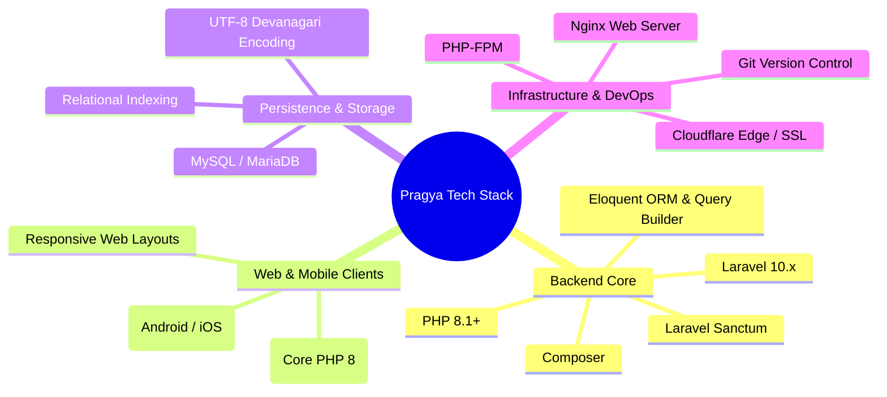

# ⚙️ Pragya Crop Advisory — Technology Stack & Engineering Rationale

This document details the engineering choices behind the Pragya Crop Advisory platform and the technical rationale for each technology selected.

---

## 1. Technology Matrix

---

## 2. Backend Stack & Rationale

### PHP 8.1+ & Laravel 10.x
- **Choice:** Modern PHP with Laravel 10 LTS framework.
- **Rationale:**
  - **Developer Velocity & Reliability:** Laravel provides robust routing, query abstraction, migration tooling, and clean dependency injection out of the box.
  - **PHP 8 Performance:** JIT compilation, typed properties, and enhanced string functions provide rapid JSON serialization and low memory footprint.
  - **Ecosystem Maturity:** Standardized middleware, configuration management, and database seeders streamline agricultural data imports.

### Database Query Builder & Eloquent ORM
- **Choice:** Laravel Database Query Builder for high-throughput relational aggregation; Eloquent ORM for dynamic models (`Heading`).
- **Rationale:**
  - **Optimized Read Latency:** Direct Query Builder operations (`DB::table`) minimize hydration overhead when querying large agronomy datasets with multi-row joins.
  - **Dynamic Entity Modeling:** Eloquent handles dynamic metadata like navigation tabs and localized system headings cleanly.

### Laravel Sanctum
- **Choice:** Lightweight token and session authentication middleware.
- **Rationale:** Ready-to-enable token infrastructure for field officer role-based access and restricted agronomy updates without heavy OAuth2 complexity.

---

## 3. Database & Persistence Layer

### MySQL / MariaDB (utf8mb4)
- **Choice:** MySQL Relational Database with `utf8mb4` character set and `utf8mb4_unicode_ci` collation.
- **Rationale:**
  - **Bilingual Hindi & English Integrity:** Full support for Devanagari script, complex conjuncts, and Unicode agricultural scientific notations.
  - **Composite Indexing:** High-performance index lookups on composite tuples `(lang, crop_id, category)` ensuring sub-millisecond query execution.
  - **ACID Reliability:** Guarantees data consistency across crop varieties, pesticide schedules, and dynamic navigation taxonomies.

---

## 4. Web & Client Ecosystem

| Client Subsystem | Primary Tech Stack | Description |
|---|---|---|
| **Mobile Application** | Native / Cross-Platform Mobile | Clean JSON consumer app presenting stage-by-stage crop advisories, offline caching, and localized farmer interfaces. |
| **Web Portal** | Core PHP 8, Nicepage, jQuery | Browser-based desktop portal for field officers and desktop research stations. |
| **Backend REST API** | Laravel 10.x, PHP 8.1+ | Central API server delivering standardized JSON responses to all client endpoints. |

---

## 5. Infrastructure & Deployment Topology

| Component | Technology | Purpose |
|---|---|---|
| **Web Server & Reverse Proxy** | Nginx | High-concurrency reverse proxy, static asset delivery, SSL termination, and Gzip payload compression. |
| **Application Runtime** | PHP-FPM 8.1+ | Fast process manager executing Laravel worker pools with optimized opcode caching. |
| **DNS & Edge Protection** | Cloudflare Edge | Global DNS resolution, DDoS shielding, and SSL encryption. |
| **Process Daemon** | systemd / Supervisor | Automatic process management ensuring server recovery and continuous uptime. |

---

## 6. Engineering Standards & Quality Invariants

- **Strict Bilingual Isolation:** All queries filter on verified language parameters (`english`, `hindi`, `en`, `hi`) to guarantee language consistency.
- **Zero Unhandled Route Failures:** Fallback catch-all route ensures all unmatched paths return a structured `404 Not Found` JSON object rather than HTML error pages.
- **Composite Key Integrity:** Relational joins between disease symptoms and pesticide measures use explicit count indices to preserve one-to-many treatment mappings.
