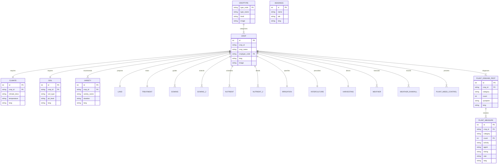

# 📊 Diagram: Database Entity Relationship (ERD)

Core domain entities and relational mappings powering the Pragya Crop Advisory agricultural knowledge engine.

```mermaid
erDiagram
    CROPTYPE ||--|{ CROP : categorizes
    CROP ||--|| CLIMATE : requires
    CROP ||--|| SOIL : requires
    CROP ||--|{ VARIETY : recommends
    CROP ||--|| LAND : prepares
    CROP ||--|| TREATMENT : treats
    CROP ||--|{ SOWING : guides
    CROP ||--|{ SOWING_2 : extends
    CROP ||--|{ NUTRIENT : schedules
    CROP ||--|{ NUTRIENT_2 : details
    CROP ||--|| IRRIGATION : specifies
    CROP ||--|| INTERCULTURE : prescribes
    CROP ||--|| HARVESTING : directs
    CROP ||--|{ WEATHER : forecasts
    CROP ||--|{ WEATHER_RAINFALL : records
    CROP ||--|{ PLANT_WEED_CONTROL : prevents
    CROP ||--|{ PLANT_DISEASE_PEST : diagnoses
    PLANT_DISEASE_PEST ||--|{ PLANT_MEASURE : resolves

    CROPTYPE {
        string type_code PK
        string type_name
        string hindi
        string image
    }

    CROP {
        int id PK
        string crop_id
        string crop_name
        string croptype_code FK
        string lang
        string image
    }

    CLIMATE {
        int id PK
        string crop_id FK
        string climate_desc
        string temperature
        string lang
    }

    SOIL {
        int id PK
        string crop_id FK
        string soil_type
        string ph_level
        string lang
    }

    VARIETY {
        int id PK
        string crop_id FK
        string variety_name
        string duration
        string lang
    }

    PLANT_DISEASE_PEST {
        int id PK
        string crop_id FK
        string category
        int count
        string symptom
        string lang
    }

    PLANT_MEASURE {
        int id PK
        string crop_id FK
        string category
        int count FK
        string activity
        string agent
        string timing
        string rate
        string lang
    }

    HEADINGS {
        int id PK
        string name
        string tab
        string lang
    }
```
