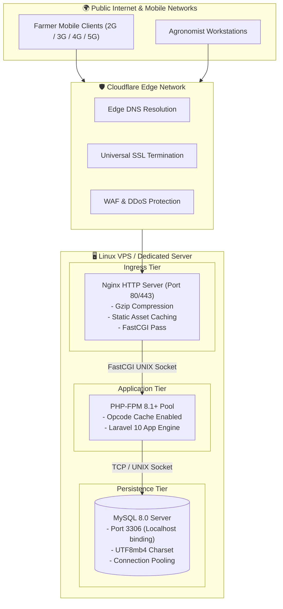

# 🚀 Diagram: Deployment & Cloud Topology

Infrastructure and hosting topology for the Pragya Crop Advisory API services.

```mermaid
flowchart TD
    subgraph Internet["🌍 Public Internet & Mobile Networks"]
        USER["Farmer Mobile Clients (2G / 3G / 4G / 5G)"]
        WEB_USER["Agronomist Workstations"]
    end

    subgraph CDN["🛡️ Cloudflare Edge Network"]
        DNS["Edge DNS Resolution"]
        SSL["Universal SSL Termination"]
        WAF["WAF & DDoS Protection"]
    end

    subgraph Host["🖥️ Linux VPS / Dedicated Server"]
        subgraph IngressTier["Ingress Tier"]
            NGINX["Nginx HTTP Server (Port 80/443)\n- Gzip Compression\n- Static Asset Caching\n- FastCGI Pass"]
        end

        subgraph AppTier["Application Tier"]
            PHP["PHP-FPM 8.1+ Pool\n- Opcode Cache Enabled\n- Laravel 10 App Engine"]
        end

        subgraph DatabaseTier["Persistence Tier"]
            MYSQL[("MySQL 8.0 Server\n- Port 3306 (Localhost binding)\n- UTF8mb4 Charset\n- Connection Pooling")]
        end
    end

    USER --> CDN
    WEB_USER --> CDN
    CDN --> NGINX
    NGINX -->|FastCGI UNIX Socket| PHP
    PHP -->|TCP / UNIX Socket| MYSQL
```
