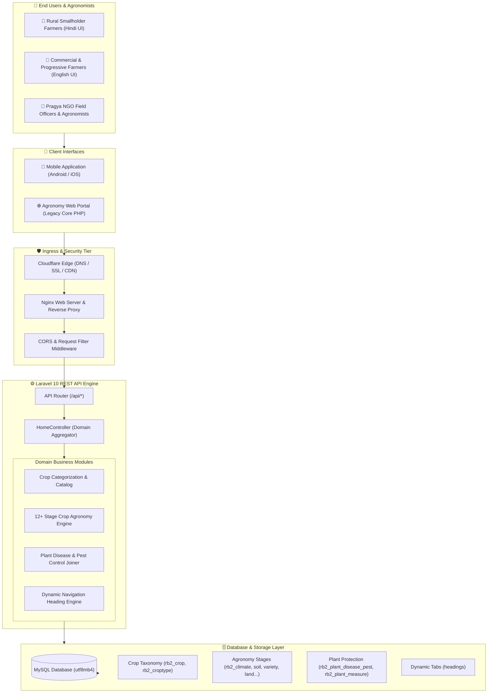

# 🏛️ Diagram: High-Level System Architecture

Comprehensive topology showing client consumers, ingress routing, Laravel 10 API engine, and MySQL data tier.

```mermaid
flowchart TD
    subgraph Users["👥 End Users & Agronomists"]
        U1["🌾 Rural Smallholder Farmers (Hindi UI)"]
        U2["🚜 Commercial & Progressive Farmers (English UI)"]
        U3["🏢 Pragya NGO Field Officers & Agronomists"]
    end

    subgraph Clients["📱 Client Interfaces"]
        M_APP["📱 Mobile Application (Android / iOS)"]
        W_PORT["🌐 Agronomy Web Portal (Legacy Core PHP)"]
    end

    subgraph Ingress["🛡️ Ingress & Security Tier"]
        CF["Cloudflare Edge (DNS / SSL / CDN)"]
        NGINX["Nginx Web Server & Reverse Proxy"]
        G_CORS["CORS & Request Filter Middleware"]
    end

    subgraph API["⚙️ Laravel 10 REST API Engine"]
        ROUTER["API Router (/api/*)"]
        CTRL["HomeController (Domain Aggregator)"]
        
        subgraph SubModules["Domain Business Modules"]
            MOD_CAT["Crop Categorization & Catalog"]
            MOD_AGRI["12+ Stage Crop Agronomy Engine"]
            MOD_IPM["Plant Disease & Pest Control Joiner"]
            MOD_HEAD["Dynamic Navigation Heading Engine"]
        end
    end

    subgraph Storage["🗄️ Database & Storage Layer"]
        DB[("MySQL Database (utf8mb4)")]
        T_TAX["Crop Taxonomy (rb2_crop, rb2_croptype)"]
        T_STAGE["Agronomy Stages (rb2_climate, soil, variety, land...)"]
        T_PROT["Plant Protection (rb2_plant_disease_pest, rb2_plant_measure)"]
        T_META["Dynamic Tabs (headings)"]
    end

    Users --> Clients
    Clients --> CF --> NGINX --> G_CORS --> ROUTER --> CTRL
    CTRL --> SubModules
    SubModules --> Storage
    Storage --> DB
```
