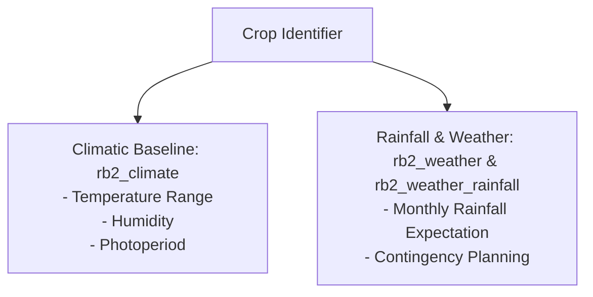

# 🌦️ Domain: Climate & Weather Advisory Engine

This document details how agro-climatic conditions and precipitation guidelines are modeled in the Pragya Crop Advisory Platform.

---

## 1. Domain Overview

Weather volatility and climate variability directly impact sowing timelines, irrigation requirements, and disease vulnerability. The weather domain pairs historical climatic baselines with seasonal rainfall guidance.

---

## 2. Climatic Baseline Dimensions (`rb2_climate`)

- **Germination Temperature:** Threshold temperature ($\text{°C}$) required for optimal seed sprouting.
- **Vegetative Growth Requirements:** Temperature and sunshine hour ranges needed during tillering and branching.
- **Grain Filling / Ripening Thresholds:** Critical upper limits where high ambient heat induces forced maturity and yield shrinkage.

---

## 3. Rainfall Advisory & Moisture Contingency (`rb2_weather_rainfall`)

- **Sub-Category Moisture Breakdown:** Categorized guidelines on managing excess precipitation vs drought stress.
- **Drainage Protocols:** Instructions for clearing field furrows during unseasonal cloudbursts.
- **Supplemental Irrigation Triggers:** Soil moisture tension indicators triggering emergency irrigation during prolonged dry spells.
