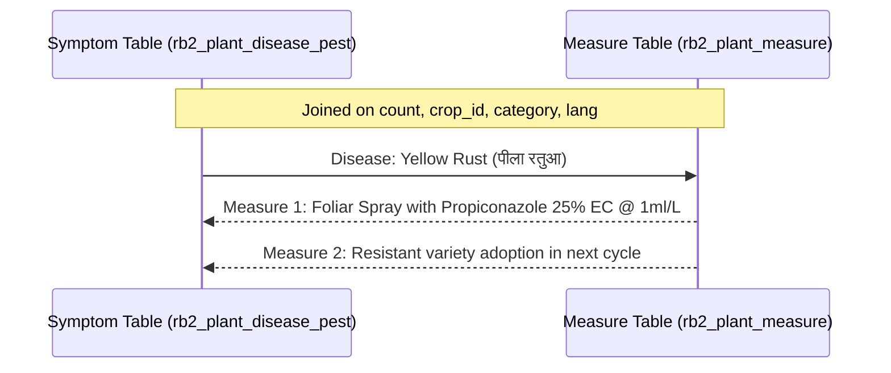

# 🐛 Domain: Integrated Pest Management (IPM) & Disease Diagnosis

This document details the relational modeling and diagnostic decision trees for crop diseases, insect pests, and weed management.

---

## 1. Domain Modeling: Three-Tier Protection

Crop damage is categorized into three discrete diagnostic pillars:

```mermaid
flowchart TD
    PROT[Plant Protection Domain]
    PROT --> W[1. Weed Control\nrb2_plant_weed_control]
    PROT --> D[2. Disease Diagnosis\nrb2_plant_disease_pest (category: disease)]
    PROT --> P[3. Insect & Pest Control\nrb2_plant_disease_pest (category: pest_control)]
    
    D --> M1[Actionable Measures\nrb2_plant_measure]
    P --> M2[Actionable Measures\nrb2_plant_measure]
```

---

## 2. Symptom-to-Measure Relational Linkage

To ensure farmers receive practical, step-by-step chemical and organic remedies, each disease/pest record is mapped to one or more actionable measures using a composite tuple `(crop_id, category, count, lang)`:



---

## 3. Data Entities & Fields

### Diagnostic Symptom (`rb2_plant_disease_pest`)
- **`crop_id`**: Target crop foreign key.
- **`category`**: Diagnostic type (`disease` or `pest_control`).
- **`count`**: Sequential index linking symptom to treatment measures.
- **`symptom`**: Detailed visual symptoms on leaves, stems, pods, or roots.

### Actionable Measure (`rb2_plant_measure`)
- **`activity`**: Prescribed operation (Seed Treatment, Soil Drenching, Foliar Spray).
- **`timing`**: Execution window (e.g., *At initial symptom onset*).
- **`agent`**: Active chemical or biological agent (*Chlorpyrifos*, *Mancozeb*, *Neem Oil*).
- **`rate`**: Exact dilution ratio and dosage per acre/hectare (e.g. *2g per litre of water*).
