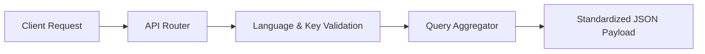

# 🔌 Engineering: API Design & Contract Standards

This document outlines the API design standards, routing patterns, response envelopes, and error handling protocols used in the Pragya Crop Advisory API.

---

## 1. REST Endpoint Topology

All endpoints follow deterministic, resource-oriented URI conventions:

```
GET /api/croptype/{ln}
GET /api/cropslist/{ln}/{type}
GET /api/detail-headings/{ln}
GET /api/details/{topic}/{ln}/{crop_id}
```



---

## 2. Response Envelopes

### 2.1 Standard Array Response (e.g. Categories, Crops List, Headings)
Endpoints returning collections output clean JSON arrays directly:

```json
[
  {
    "id": 1,
    "name": "जलवायु (Climate)",
    "tab": "climate",
    "lang": "hindi"
  }
]
```

### 2.2 Composite Multi-Dataset Response (e.g. Plant Protection, Sowing, Weather)
Endpoints delivering multi-tiered datasets aggregate related sub-tables into structured keys:

```json
{
  "data": [ ...primary records... ],
  "data2": [ ...secondary records / joined measures... ],
  "data3": [ ...tertiary records / pest control... ]
}
```

---

## 3. Error Handling & Fallback Contracts

### 3.1 Resource Not Found (`404 Not Found`)
When an invalid locale, nonexistent topic key, or unmapped crop ID is requested:

```json
{
  "error": "Not found"
}
```

### 3.2 Global Catch-All Fallback Route
To prevent HTML stack traces or server error leakages on mobile devices, an explicit wildcard route intercepts all unmatched paths:

```php
Route::any('{any}', [HomeController::class, 'notFound'])->where('any', '.*');
```

Response:
```json
{
  "error": "Not Found"
}
```
HTTP Status: `404 Not Found`
