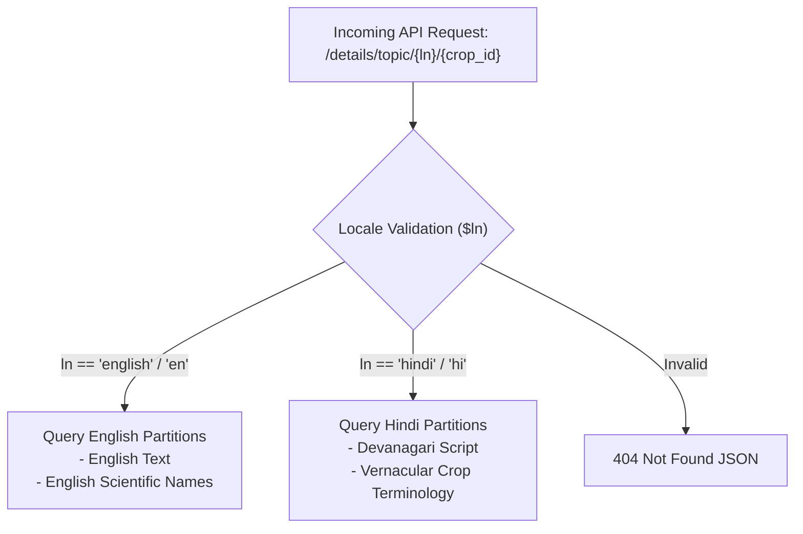

# 🌐 Engineering: Bilingual Localization Strategy

This document details the localization architecture supporting both vernacular Hindi (`हिंदी`) and English across all agricultural API services.

---

## 1. Localization Philosophy

Rural Indian smallholder farmers primarily interact with mobile applications in regional languages (Hindi), whereas field agronomists and institutional officers often utilize English nomenclature. The platform treats localization as a **First-Class Architectural Invariant**:



---

## 2. Dynamic Column & Table Query Mapping

Depending on the domain entity, localization is resolved via column aliases or explicit row filtering:

### 2.1 Column-Level Alias Mapping (`rb2_croptype`)
In category listings, column aliasing maps language-specific attributes to uniform JSON fields:

```php
switch ($ln) {
    case 'en':
        $select = 'type_name';
        break;
    case 'hi':
        $select = 'hindi as type_name';
        break;
    default:
        return response()->json(['error' => 'Not found'], Response::HTTP_NOT_FOUND);
}

$data = DB::table('rb2_croptype')
    ->select($select, 'type_code', 'image')
    ->get();
```

### 2.2 Row-Level Language Partitioning (`rb2_crop`, `rb2_*`)
All detailed agronomy records contain an indexed `lang` column:

```php
$allowedValues = ['english', 'hindi'];
if (!in_array($ln, $allowedValues)) {
    return response()->json(['error' => 'Not found'], Response::HTTP_NOT_FOUND);
}

$data = DB::table($table[$topic])
    ->where(['lang' => $ln, 'crop_id' => $crop_id])
    ->get();
```

---

## 3. Database Encoding & Character Set

The database connection enforces `utf8mb4` encoding in Laravel configuration (`config/database.php`), preventing truncation or encoding corruption of Devanagari Hindi characters (`गेहूं`, `पीला रतुआ`, `सिंचाई`).
