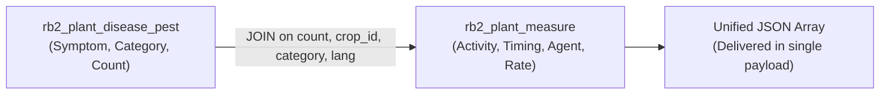

# 🔗 Engineering: Composite Relational Joins & Data Aggregation

This document details the database join architecture used to bundle multi-tiered agricultural data into unified JSON payloads.

---

## 1. The Challenge of Disconnected Agronomy Records

In relational agricultural databases, symptoms (`rb2_plant_disease_pest`) and corrective measures (`rb2_plant_measure`) are stored across separate tables linked by sequence numbers (`count`), crop identifiers (`crop_id`), and category tags (`disease`, `pest_control`).

Querying these individually would require mobile clients to make 3 to 5 separate HTTP network requests per screen, causing severe UI lag on rural 2G/3G networks.

---

## 2. Relational Join Architecture

The backend implements composite joins combining symptoms, treatment activities, chemical agents, timing, and dosage rates in a single atomic database query:

```php
public function getData($ln, $crop_id, $category) {
    return DB::table('rb2_plant_disease_pest')
        ->where([
            'rb2_plant_disease_pest.lang' => $ln,
            'rb2_plant_disease_pest.crop_id' => $crop_id,
            'rb2_plant_disease_pest.category' => $category
        ])
        ->join('rb2_plant_measure', 'rb2_plant_disease_pest.count', '=', 'rb2_plant_measure.count')
        ->where([
            'rb2_plant_measure.lang' => $ln,
            'rb2_plant_measure.crop_id' => $crop_id,
            'rb2_plant_measure.category' => $category
        ])
        ->select(
            'rb2_plant_disease_pest.*',
            'rb2_plant_measure.activity',
            'rb2_plant_measure.timing',
            'rb2_plant_measure.agent',
            'rb2_plant_measure.rate'
        )
        ->get();
}
```



---

## 3. Dynamic Topic Merging Strategy

For complex topics (`sowing`, `nutrient`, `plant_protection`, `weather`), the controller dynamically queries secondary extension tables (`rb2_sowing_2`, `rb2_nutrient_optimal_2`, `rb2_weather_rainfall`) and packages them into composite response keys (`data`, `data2`, `data3`).
