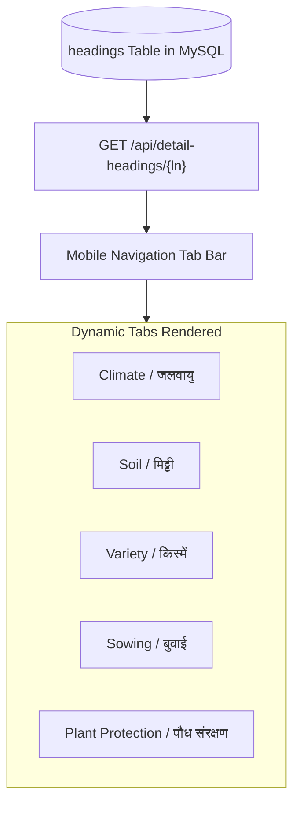

# 📑 Product: Dynamic Advisory Taxonomy Engine

This document details the dynamic navigation taxonomy engine that drives the mobile application user interface.

---

## 1. Dynamic Headings Architecture

Rather than hardcoding screen titles and tab names into the mobile application codebase, the Pragya Crop Advisory Platform utilizes a database-driven dynamic taxonomy engine (`headings` table):

---

## 2. Dynamic Schema Attributes

| Field Name | Type | Purpose | Example (`hindi`) | Example (`english`) |
| :--- | :--- | :--- | :--- | :--- |
| `name` | String | User-facing display title | `जलवायु` | `Climate` |
| `tab` | String | Unique topic identifier code | `climate` | `climate` |
| `lang` | String | Target language filter | `hindi` | `english` |

---

## 3. Product Benefits

- **Zero App Store Deployments:** Adding a new advisory category or re-ordering guidance tabs requires only a database record insertion, eliminating app update turnaround time.
- **Instant Vernacular Updates:** Grammatical corrections or dialect refinements in Devanagari text reflect immediately across all active mobile installations upon next refresh.
