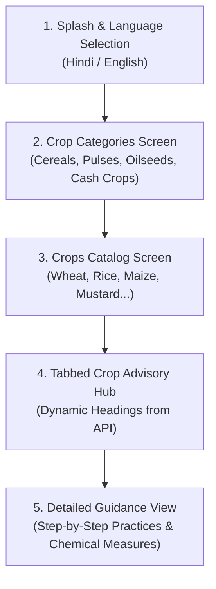

# 📱 Product: Mobile Application Specifications

This document outlines the user flows, screen contracts, and interaction patterns designed for the Pragya Crop Advisory mobile application.

---

## 1. User Journey Flow

---

## 2. Key Screen Specifications

### 2.1 Language Toggle & Category Grid
- **Screen:** Grid layout displaying visual crop icons.
- **API Endpoint:** `GET /api/croptype/{ln}`
- **Features:** Instant language toggle between Hindi (`hi`) and English (`en`).

### 2.2 Crop Selection Catalog
- **Screen:** List of registered crops under selected category.
- **API Endpoint:** `GET /api/cropslist/{ln}/{type}`
- **Features:** Search bar, crop thumbnail, scientific and regional name.

### 2.3 Tabbed Advisory Dashboard
- **Screen:** Horizontal scrollable tabs rendering dynamic headings.
- **API Endpoint:** `GET /api/detail-headings/{ln}`
- **Features:** Tabs dynamically populate without hardcoded strings in mobile app codebase.

### 2.4 Detailed Advisory Cards
- **Screen:** Stage-specific advisory (e.g. Sowing, Fertilizer, Plant Protection).
- **API Endpoint:** `GET /api/details/{topic}/{ln}/{crop_id}`
- **Features:** Expandable symptom cards, chemical spray mixing ratios, step-by-step soil prep instructions.
