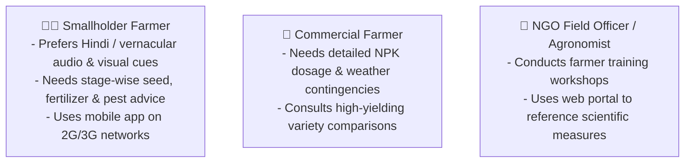

# 📱 Product: Platform Overview & Ecosystem

This document details the product vision, target audience, and multi-channel ecosystem of the Pragya Crop Advisory Platform.

---

## 1. Product Vision

The Pragya Crop Advisory Platform was conceptualized for **[Pragya NGO](https://pragya.org/about-us)** to bridge the gap between scientific agricultural research and rural smallholder farmers. By translating dense agronomy datasets into step-by-step guidance delivered in the farmer's native language, the platform empowers farming communities to increase crop yield, prevent pest losses, and conserve natural resources.

---

## 2. Target User Personas

---

## 3. Product Touchpoints

- **Mobile Application:** Consumer-facing app for farmers providing one-touch category selection, localized crop advisories, and offline-capable guides.
- **Web Portal:** Desktop reference portal used in community knowledge kiosks and training centers.
- **REST API Backend:** Central intelligence engine serving verified agronomy data.
