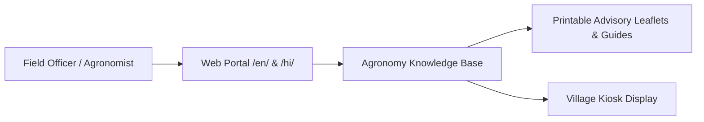

# 🌐 Product: Web Portal & Agronomy Knowledge Base

This document outlines the legacy web portal architecture and desktop interface designed for field officers and NGO training centers.

---

## 1. Web Portal Role & Functionality

The web portal (`br_cropadvisory`) serves as a comprehensive browser-based repository for field officers conducting community training sessions and village knowledge kiosks.

---

## 2. Key Modules & Layout

- **Bilingual Routing:** Language selection managed via URL prefixes (`/en/` for English, `/hi/` for Hindi).
- **Responsive Agronomy Cards:** Visual presentation of crop varieties, sowing schedules, and fertilizer calculators.
- **Detailed Protection Guides:** Visual pest and disease comparison charts.
